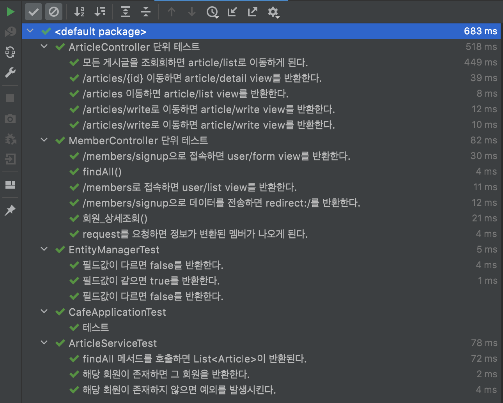

## 2022 Java Spring Cafe
2022년도 마스터즈 멤버스 백엔드 스프링 카페 프로젝트 2단계. 아래 요구사항을 만족하는 게시판을 구현한다.

  

📚	 문제 설명 및 요구사항

## 🖥 기능 요구사항
2022년도 마스터즈 멤버스 백엔드 스프링 카페 프로젝트 2단계. 아래 요구사항을 만족하는 게시판을 구현한다.

### 구현 사항
- [x] 사용자는 게시글을 작성할 수 있어야 한다.
- [x] 모든 사용자는 게시글 목록을 볼 수 있어야 한다.
- [x] 모든 사용자는 게시글 상세 내용을 볼 수 있어야 한다.
- [x] (선택) 사용자 정보를 수정할 수 있어야 한다.
  (선택) 사용자 정보를 수정할 수 있어야 한다.
      

 

📌 코딩 컨벤션

 

## 📌 코딩 컨벤션

- `기능 단위로 커밋`하며, 구현의 의미가 명확하게 전달되도록 커밋 메시지를 작성한다. 
- 커밋은 -m 사용을 `지양`하며, 구체적 내용을 기록한다.

- `readme를 상세히 작성`한다. 
    - `전체 프로젝트의 구조를 설명`한다.
    - 각 `패키지`와 `클래스, 메서드의 기능을 상세히 설명`한다.
    - (가능하다면) 패키지/클래스의 `역할과 책임을 명확하게 분리`한다.
    - 변수명은 문맥에 맞게 가장 보편적으로, 메서드명은 `무엇을 하는지를 명확히` 나타낸다.
    - 필요에 따라 그림과 PPT, 학습내용을 첨부해 `알기 쉽게 작성`한다.
    - 테스트 케이스를 기록하며 석연치 않은 부분을 매번 체크한다.

- 함수나 메소드의 들여쓰기를 가능하면 적게하도록 노력한다. 
    - 한 메서드에는 가급적 `두 단계 이내`의 들여쓰기를 한다.
- 함수나 메소드는 한 번에 한 가지 일을 하고 가능하면 20줄이 넘지 않도록 구현한다. 
- else 예약어를 지양한다.

  

## 테스트 

