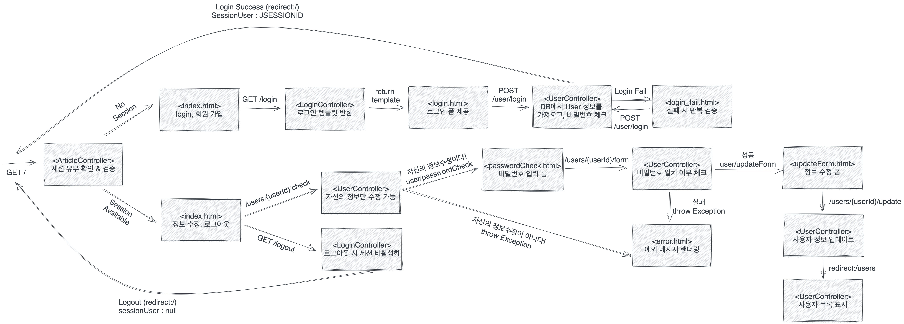

# 2022 Java Spring Cafe

2022년도 마스터즈 멤버스 백엔드 스프링 카페 프로젝트

## 스프링 카페 3단계 - DB에 저장하기

---

### 1. 2단계 피드백 반영 + 추가 변경 사항

- [X] String writeTime -> LocalDateTime 타입으로 변경
- [X] isYourPassword & checkIfTheIDIsTheSame 테스트 추가
- [ ] ControllerAdvice 외에 다른 예외처리 방법 고려
- [X] Repository interface name 변경
- [X] UserRepository의 Update를 save로 옮김
- [X] 테스트 name 변경
- [X] UserRepository 내의 private method로 중복 id 검증을 Service Layer로 옮기기
- [X] Service 내에서 DTO 생성 중, View에 쓰일 numbering을 제거하고 템플릿 엔진에서 처리해보기

### 2. 전체 요구사항 체크리스트

- [X] H2 데이터베이스 연동
- [X] 게시글 데이터 저장
- [X] 게시글 목록 구현
- [X] 게시글 상세보기 구현
- [X] 사용자 정보 DB에 저장
- [X] ``Heroku``로 배포

 

#### 2.1 H2 데이터베이스 연동 

- yml을 실행용과 테스트용으로 구분
- JDBC Connection 관련 테스트 완료
  - [X] JdbcManualTest : 수동 Connection 테스트
  - [X] JdbcAutoTest : Hikari pool을 이용한 연결 및 DB 조회 테스트
  - [X] SpringJdbcTest : JdbcTemplate를 이용한 DB 조회 테스트

 

#### 2.2 게시글 데이터 저장

- [X] 새로 구현한 ``H2ArticleRepository``에 @Primary를 이용하여 1순위 주입 대상으로 변경

- Article 클래스를 DB 테이블에 저장할 수 있도록 구현 
  - [X] save 구현 & TEST

- Article 테이블이 적절한 PK를 가지도록 구현
  - [X] PK로 기존에 작성된 ``Long id`` 사용(auto increment 적용) 

 

#### 2.3 게시글 목록 구현
- 전체 게시글 목록 데이터를 DB에서 조회하도록 구현
  - [X] findAll 구현 & TEST 

 

#### 2.4 게시글 상세보기 구현
- 게시글의 세부 내용을 DB에서 가져오도록 구현
  - [X] findById 구현 & TEST
  
 

#### 2.5 사용자 정보 DB에 저장
- 회원가입을 통해 등록한 사용자 정보를 DB에 저장한다.
  - [X] UserRepository 메서드 구현(save, findById, findAll)
  - [X] 중복 검증
  - [X] 사용자 정보 update 구현
  - [X] Test

 

#### 2.6 배포
- [X] ``Heroku``로 배포를 진행한다.

 

## 스프링 카페 4단계 - 로그인 구현

---

### 1. 3단계 피드백 반영 + 추가 변경 사항

- [X] 작성 예정

### 2. 전체 요구사항 체크리스트

#### 요청 흐름도

#### 전체 기능
- 로그인 기능 구현
  - [X] 현재 상태가 로그인 상태라면 메뉴에서 "로그아웃", "개인 정보 수정"이 표시되어야 한다.
    - ``@CookieValue``를 통해 `sessionUser`라는 쿠키가 있는지 확인한다. 
    - ``session.getAttribute``를 통해 세션에 존재하는 User인지 검증한다.
    - 이를 통해 ``sessionUser``가 조작된 상태일 경우에도 검증할 수 있다.
- 로그아웃 기능(로그인 되지 않는 상태) 구현
  - 현재 상태가 로그인 상태가 아니라면 상단 메뉴에서 "로그인", "회원가입"이 표시되어야 한다.
    - [X] 세션 확인 후 세션 id 없다면 로그아웃된 상태로 간주 
- 개인 정보 수정 기능
  - [X] 로그인한 사용자만 "자신"의 정보를 수정할 수 있어야 한다.
  - [X] 이름, 이메일만 수정 가능하다. 비밀번호가 일치해야 한다.

- [X] 기능 테스트 수행
  - ``MockHttpSession``을 사용하여 세션이 있을 경우, 없을 경우 각각 테스트를 수행
  - ModelResultMatcher의 attribute 메서드를 사용하여, 예외 페이지로 전달된 에러 메세지 검증 추가 

 

## 스프링 카페 5단계 - 게시글 권한부여

---

### 1. 4단계 피드백 반영 + 추가 변경 사항

- [X] 작성 예정

### 2. 전체 요구사항 

#### 구현 필요 기능

스프링 부트를 통해 인증 및 권한 부여를 구현한다.
- 로그인하지 않은 사용자는 게시글의 목록만 볼 수 있다.
- 로그인한 사용자만 게시글의 세부 내용 확인 가능하다.
- 로그인한 사용자만 게시글을 작성 가능하다.
- 로그인한 사용자는 자신의 글을 수정 및 삭제할 수 있다.

 

#### 기능 체크
- 게시글 작성하기 
  - [X] 로그인하지 않은 사용자가 글쓰기 페이지에 접근할 경우, 로그인 페이지로 이동
  - [X] 글 작성 화면에서 글쓴이 입력 필드 삭제. User의 name이 여기에 표시되도록 한다.
  - [X] 수정 후 POST 요청을 날릴 때 user name이 함께 넘어갈 수 있도록 readOnly 설정을 한다.(disable로 두면 같이 넘어가지 않는다.)
- 게시글 수정하기
  - [ ] 수정하기 폼과 수정하기 기능은 로그인 사용자와 글쓴이의 사용자 아이디가 같은 경우에만 가능하다. 관련 에러 검증 필요
  - [ ] ``@PutMapping`` 사용
- 게시글 삭제하기
  - [ ] 삭제하기는 로그인 사용자와 글쓴이의 사용자 아이디가 같은 경우에만 가능하다. 관련 에러 검증 필요
  - [ ] ``@DeleteMapping`` 사용
