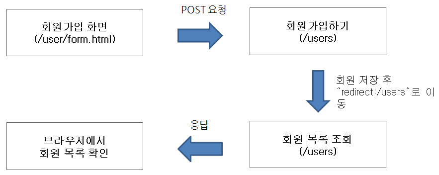
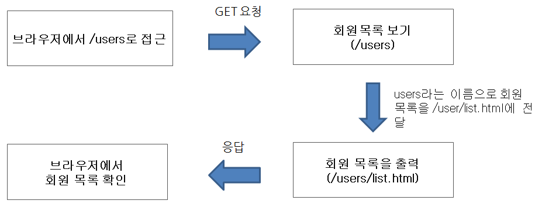
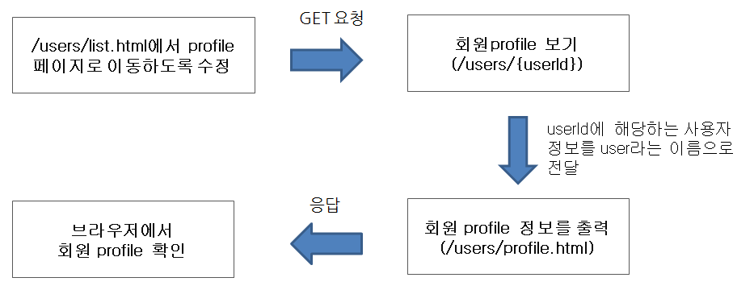

## 2022 Java Spring Cafe

2022년도 마스터즈 멤버스 백엔드 스프링 카페 프로젝트

<br/><br/>

<details>
<summary>📚 문제 설명 및 요구사항</summary>
<div markdown="1">
<br/>

### ✍🏻 기능요구사항

- static 폴더에 있는 기존 자료(QA 게시판) 를 수정하거나 아래 디자인 기획서를 참고해서 구현한다.

- 디자인은 자유롭게 구현해도 무방하다.

> 디자인 기획서, 마크업 파일 참고

<br/><br/><br/><br/>

### 💻 프로그래밍 요구사항

프로그래밍 요구사항은 아래 규칙을 따른다.

<br/><br/>

### 회원 가입 기능 구현

- 가입하기 페이지에서 회원 가입 폼을 표시한다.
- 개인정보를 입력하고 확인을 누르면 회원 목록 조회 페이지로 이동한다.

<br/>



<br/><br/><br/><br/>

### 회원 목록 조회 기능 구현

- 목록 조회 페이지에서는 가입한 회원들의 목록을 출력한다.

<br/>



<br/><br/><br/><br/>

### 회원 프로필 조회 기능 구현

- 회원 프로필 페이지에서는 개별 회원의 프로필 정보를 출력한다.



<br/><br/><br/><br/>

### 각 기능에 따른 url과 메소드 convention

- 먼저 각 기능에 대한 대표 url을 결정한다.

    - 예를 들어 회원관리와 관련한 기능의 대표 URL은 "/users"와 같이 설계한다.

- 기능의 세부 기능에 대해 일반적으로 구현하는 기능(목록, 상세보기, 수정, 삭제)에 대해서는 URL convention을 결정한 후 사용할 것을 추천한다.

    - 예를 들어 todo 앱에 대한 URL convention을 다음과 같은 기준으로 잡을 수 있다.

<br/>

|  No |    <center>url</center>       | <center>기능</center>   |
|:---:|:------------------------------|:-----------------------|
|  1  |&nbsp; GET/todos               |&nbsp; List all todos   |
|  2  |&nbsp; POST/todos              |&nbsp; Create a new todo|
|  3  |&nbsp; GET/todos/:id           |&nbsp; Get a todo       |
|  4  |&nbsp; PUT/todos/:id           |&nbsp; Update a todo    |
|  5  |&nbsp; DELETE/todos/:id        |&nbsp; Delete a todo and its items|
|  6  |&nbsp; GET/todos/:id/items     |&nbsp; Get a todo item  |
|  7  |&nbsp; PUT/todos/:id/items     |&nbsp; Update a todo item |
|  8  |&nbsp; DELETE/todos/:id/items  |&nbsp; Delete a todo item |

<br/><br/><br/><br/>

### 회원가입 기능 구현

- 가입하기 페이지는 static/user/form.html을 사용한다.

- static에 있는 html을 templates로 이동한다.

- 사용자 관리 기능 구현을 담당할 UserController를 추가하고 애노테이션 매핑한다.

    - @Controller 애노테이션 추가

- 회원가입하기 요청(POST 요청)을 처리할 메소드를 추가하고 매핑한다.

    - @PostMapping 추가하고 URL 매핑한다.

- 사용자가 전달한 값을 User 클래스를 생성해 저장한다.

    - 회원가입할 때 전달한 값을 저장할 수 있는 필드를 생성한 후 setter와 getter 메소드를 생성한다.

- 사용자 목록을 관리하는 ArrayList를 생성한 후 앞에서 생성한 User 인스턴스를 ArrayList에 저장한다.

- 사용자 추가를 완료한 후 사용자 목록 페이지("redirect:/users")로 이동한다.

<br/><br/><br/><br/>

### 회원목록 기능 구현

- 회원목록 페이지는 static/user/list.html을 사용한다.

- static에 있는 html을 templates로 이동한다.

- Controller 클래스는 회원가입하기 과정에서 추가한 UserController를 그대로 사용한다.

- 회원목록 요청(GET 요청)을 처리할 메소드를 추가하고 매핑한다.

    - @GetMapping을 추가하고 URL 매핑한다.

- Model을 메소드의 인자로 받은 후 Model에 사용자 목록을 users라는 이름으로 전달한다.

- 사용자 목록을 user/list.html로 전달하기 위해 메소드 반환 값을 "user/list"로 한다.

- user/list.html 에서 사용자 목록을 출력한다.

- user/list.html 에서 사용자 목록 전체를 조회하는 방법은 다음과 같다.

````thymeleafexpressions
{{#users}}
    // 데이터 조회
{{/users}}
````

<br/><br/><br/><br/>

### 회원 프로필 정보보기

- 회원 프로필 보기 페이지는 static/user/profile.html을 사용한다.

- static에 있는 html을 templates로 이동한다.

- 앞 단계의 사용자 목록 html인 user/list.html 파일에 닉네임을 클릭하면 프로필 페이지로 이동하도록 한다.

    - html에서 페이지 이동은 <a /> 태그를 이용해 가능하다.

    - <a href="/users/{{userId}}" />와 같이 구현한다.

- Controller 클래스는 앞 단계에서 사용한 UserController를 그대로 사용한다.

- 회원프로필 요청(GET 요청)을 처리할 메소드를 추가하고 매핑한다.

    - @GetMapping을 추가하고 URL 매핑한다.

    - URL은 "/users/{userId}"와 같이 매핑한다.

- URL을 통해 전달한 사용자 아이디 값은 @PathVariable 애노테이션을 활용해 전달 받을 수 있다.

- ArrayList에 저장되어 있는 사용자 중 사용자 아이디와 일치하는 User 데이터를 Model에 저장한다.

- user/profile.html 에서는 Controller에서 전달한 User 데이터를 활용해 사용자 정보를 출력한다.

<br/><br/><br/><br/>

### HTML의 중복 제거

> index.html, /user/form.html, /qna/form.html 코드를 보면 header, navigation bar, footer 부분에 많은 중복 코드가 있다. 중복 코드를 제거한다.

<br/><br/><br/><br/>

### 추가학습거리

템플릿 엔진(mustache)의 사용법을 익힌다.

<br/><br/>

### template engine

- HTML 문법 만으로는 if/for/while과 같은 프로그래밍이 가능하지 않다. 즉, HTML만 활용하는 경우 항상 같은 데이터(정적인)만 서비스가 가능하다.

- 사용자에 따라 다른 HTML, 데이터에 따라 다른 HTML을 제공하려면 if/for/while과 같은 프로그래밍이 가능해야 한다. 이와 같이 서로 다른 HTML(동적인)을 제공하기 위한 도구가 template
  engine이다.

- template engine의 역할은 JSP, ASP, PHP가 하는 역할과 같다고 생각하면 된다.

<br/><br/><br/>

### mustache 설정

- 정적인(static) HTML은 static 폴더에서 관리하고 동적인(dynamic) HTML은 templates 디렉토리에서 관리한다.

- html 소스 코드를 수정할 경우 매번 서버를 재시작해야 한다. 이 같은 단점을 보완하기 위해 application.properties 파일에 다음과 같이 설정한다.

> spring.mustache.suffix=.html
> spring.mustache.cache=false

<br/><br/><br/>

### mustache 기본 문법

> https://mustache.github.io/mustache.5.html

<br/><br/><br/>

### html 중복 제거 힌트

중복 코드가 발생하는 부분을 partial을 이용해서 별도의 template 파일로 분리한다.

<br/>

base.mustache

```text
<h2>Names</h2>
{{#names}}
  {{> user}}
{{/names}}
```

<br/><br/>

user.mustache

```text
<strong>{{name}}</strong>
```

<br/><br/>

결과물

```text
<h2>Names</h2>
{{#names}}
  <strong>{{name}}</strong>
{{/names}}
```

<br/><br/><br/><br/>

### URL과 html 쉽게 연결하기

앞 단계와 같이 html에서 중복을 제거하는 기능은 handlebars.java template engine에서 제공하는 기능이다. 따라서 모든 html의 중복을 제거하려면 static의 html 또한
templates 폴더로 이동하고 URL 매핑을 해야 한다. 그런데 이와 같이 구현할 경우 특별한 로직이 없음에도 불구하고 매번 메소드를 만들고 매핑하는 일이 귀찮은 작업이다. 이 같은 단점을 다음과 같이 보완할 수
있다.

- base package 아래에 config와 같은 새로운 패키지 생성한다.
- MvcConfig 이름으로 클래스를 생성해 다음과 같은 형태로 구현한다.

<br/><br/><br/>

아래의 Adapter가 deprecated되었는데 이유와 해결책에 대해 생각해 보고 해결하자.

````java

@Configuration
public class MvcConfig extends WebMvcConfigurerAdapter {
    @Override
    public void addViewControllers(ViewControllerRegistry registry) {
        registry.setOrder(Ordered.HIGHEST_PRECEDENCE);

        registry.addViewController("/users/form").setViewName("user/form");
        registry.addViewController("/users/login").setViewName("user/login");
        registry.addViewController("/questions/form").setViewName("qna/form");
    }
}
````

<br/><br/>

</div>
</details>

<details>
<summary>📌 코딩 컨벤션</summary>
<div markdown="1">
<br/>

## 📌 코딩 컨벤션

- `기능 단위로 커밋`하며, 구현의 의미가 명확하게 전달되도록 커밋 메시지를 작성한다.<br/>
- 커밋은 -m 사용을 `지양`하며, 구체적 내용을 기록한다.

- `readme를 상세히 작성`한다.<br/>
    - `전체 프로젝트의 구조를 설명`한다.
    - 각 `패키지`와 `클래스, 메서드의 기능을 상세히 설명`한다.
    - (가능하다면) 패키지/클래스의 `역할과 책임을 명확하게 분리`한다.
    - 변수명은 문맥에 맞게 가장 보편적으로, 메서드명은 `무엇을 하는지를 명확히` 나타낸다.
    - 필요에 따라 그림과 PPT, 학습내용을 첨부해 `알기 쉽게 작성`한다.
    - 테스트 케이스를 기록하며 석연치 않은 부분을 매번 체크한다.

- 함수나 메소드의 들여쓰기를 가능하면 적게하도록 노력한다.<br/>
    - 한 메서드에는 가급적 `두 단계 이내`의 들여쓰기를 한다.
- 함수나 메소드는 한 번에 한 가지 일을 하고 가능하면 20줄이 넘지 않도록 구현한다. <br/>
- 무분별한 static의 사용을 최대한 `지양`한다.
- else 예약어를 `지양`한다.
- 함수나 메소드의 들여쓰기를 가능하면 적게(3단계까지만) 할 수 있도록 노력한다.

```javascript
 function main() {
    for (i = 0; i < 10; i++) { // 들여쓰기 1단계
        if (i == 2) { // 들여쓰기 2단계
            return; // 들여쓰기 3단계
        }
    }
}
```

<br/>

</div>
</details>


<br/><br/>

### 고민사항

`테스트를 어디서부터 시작해야 할 지` 조금 막막했습니다. 어떤 인자를 받아야 할 지, 어떤 결과를 비교해야 할지, 그 과정에서 어떤 예외들이 발생할지 등 다양한 상황이 있는데 기준을 잘 잡지 못하겠습니다.

<br/>

- 인자
- 어떤 결과를 비교할 지
- 어떤 예외가 발생할 지
- 에러 페이지를 어떻게 처리할 지
